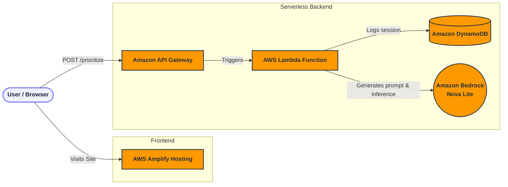

# FocusFlow 🧠⚡

[](https://aws.amazon.com)
[](https://reactjs.org/)
[](https://vitejs.dev/)
[](https://aws.amazon.com/serverless/)
[](https://opensource.org/licenses/MIT)

**FocusFlow** is a premium, AI-powered task prioritizer built for the **AWS Weekend Productivity Challenge**. It cures decision fatigue by taking your chaotic brain-dump of daily tasks and instantly turning it into a structured, categorized, and scored daily schedule.

> **Live Demo:** [Live APP](https://main.d1xqv5h2l9qnsy.amplifyapp.com/)

---

## 🎯 The Vision

We all have a running mental list of things to do, but deciding *what to do next* often causes decision fatigue. Traditional to-do apps give you a static checklist and force you to assign arbitrary priorities. 

FocusFlow acts as your personal executive assistant. Powered by **Amazon Bedrock (Nova Lite)**, it analyzes your raw tasks, scores each item on urgency and impact, and returns a fully actionable daily plan with time-blocking (Morning, Afternoon, Evening) and categorizations (Deep Work, Comms, Admin).

---

## 🏗️ Architecture & Tech Stack

FocusFlow is a 100% serverless application built entirely on the AWS Free Tier, optimized for extreme speed and low maintenance.



### 💻 Frontend (React + Vite)
- **Framework:** React 18 with Vite for blazing fast HMR and builds.
- **Styling:** Vanilla CSS Modules with a custom dark-mode "editor" design system.
- **Typography:** `Inter` for legibility and `JetBrains Mono` for data density.
- **Hosting:** AWS Amplify Hosting (Global Edge CDN).

### ☁️ Backend (AWS Serverless)
- **Infrastructure:** AWS Serverless Application Model (SAM).
- **Compute:** AWS Lambda (Python 3.12).
- **API:** Amazon API Gateway (REST).
- **Database:** Amazon DynamoDB (On-Demand with 30-day TTL).
- **AI/ML:** Amazon Bedrock (`amazon.nova-lite-v1:0`).

---

## 🚀 Local Development Setup

### Prerequisites
- Node.js (v18+)
- Python (3.12+)
- AWS CLI configured with administrator access (`aws configure`)
- AWS SAM CLI installed

### 1. Backend Setup

First, ensure you have enabled model access for **Amazon Nova Lite** in the AWS Bedrock Console for your region (e.g., `us-east-1`).

```bash
# Navigate to backend directory
cd backend

# Build the SAM application
sam build

# Deploy to your AWS account
sam deploy --guided
```
*Note the `ApiUrl` provided in the CloudFormation outputs upon successful deployment.*

### 2. Frontend Setup

```bash
# Navigate to frontend directory
cd frontend

# Install dependencies
npm install
```

Update the `API_URL` in `frontend/src/constants.js` with the API Gateway URL generated from your SAM deployment:
```javascript
export const API_URL = "https://<your-api-id>.execute-api.us-east-1.amazonaws.com/prod/prioritize";
```

Start the local development server:
```bash
npm run dev
```

---

## 📦 One-Click Deployment Script

For convenience, a full stack deployment script is included. It handles SAM building, CloudFormation deployment, frontend Vite building, zipping, and AWS Amplify deployment.

```bash
chmod +x deploy.sh
./deploy.sh
```

---

## 🏆 Hackathon Details
Built by **Binod Joshi** for the July 2026 AWS Builder Center hackathon. 

- **Primary Goal:** Prove that powerful, AI-driven applications can be built entirely on AWS Free Tier services using Serverless architecture.
- **Key Challenge Overcome:** Ensuring strict JSON output from LLMs for predictable frontend UI rendering without relying on heavyweight frameworks.
